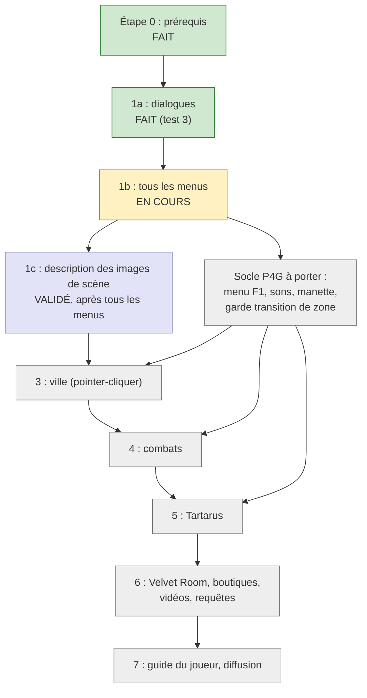

# Feuille de route et état du chantier

Mise à jour : 29/09/2026. Vue de gestion de projet : ce qui est fait, en cours, à faire et à
venir. Le plan d'origine (faisabilité, risques) est dans [PLAN.md](../PLAN.md) ; le point de
reprise immédiat est dans [HANDOFF.md](HANDOFF.md).

Règle de passage (décision du joueur, 28/09/2026) : **une étape n'est finie que si le test en jeu
est réussi**, et rien après l'étape 1 (ville, combats, Tartarus) ne commence tant que tous les
dialogues et tous les menus ne sont pas lus.

Précision du joueur, 29/09/2026 : développer et contrôler des lots cohérents avant de
solliciter un test en jeu. Plusieurs sous-menus peuvent avancer sans attendre un retour
à chaque modification. La validation joueur reste distincte des contrôles hors jeu.

## Diagramme

Version texte juste en dessous (le diagramme est pour un affichage visuel, GitHub ou VS Code).

Lecture du diagramme : 0, puis 1a, puis 1b. Après 1b viennent deux branches, 1c (images) et le
socle P4G, qui mènent toutes deux à l'étape 3. Ensuite 3, 4, 5, 6, 7 dans l'ordre. Le socle P4G
sert aussi aux étapes 4 et 5.

## Fait

- **Catalogue local des images de menus** (29/09/2026, Codex) : 1 112 planches PNG,
  4 542 éléments découpés, index par système et provenance, ressources communes et françaises.
  Contrôlé hors jeu, sans valider de nouveaux lecteurs. Voir `MENU_IMAGES.md` et
  `WORKSPACE_GUIDE.md` pour les repères P3P/P4G.
- **Étape 0, prérequis** (28/09/2026) : jeu Steam, Reloaded-II, Persona Essentials, variables
  d'environnement, outils de rétro-ingénierie (Ghidra, Atlus Script Tools, CriFsLib).
- **Squelette du mod** : parole Tolk (`Speech.cs`), historique Maj+[ / Maj+] et répétition Maj+P,
  coupure des dialogues Maj+M (`HistoryKeys.cs`), messages FR/EN (`Loc.cs`), lecture mémoire
  gardée (`Utils.cs`), décodage du texte Atlus avec accents (`Native/Text/`).
- **1a, dialogues** (réussi au test 3) : messages, pages suivantes, nom de l'orateur, choix
  Oui / Non (`Dialogue.cs`, doc `DIALOGUE.md`).
- **Titre de fenêtre** relu par NVDA : corrigé (`TitleBar.cs`, validé au test 4).
- **1b, premiers menus** (réussis au test 4) : écran titre (`TitleMenu.cs`), choix du sexe et de
  la difficulté (`SexSelectMenu.cs`), doc `MENUS.md`.
- **Traduction** (29/09/2026, à valider au prochain test en jeu) : messages du mod dans
  `lang/<langue>.json`, anglais de référence, français complet, repli sur l'anglais, 9 langues
  du jeu dans le réglage, vérificateur `tools/lang_check.py` lancé aussi sur GitHub, guide des
  contributeurs `lang/README.md`. Doc : `LOCALIZATION.md`.
- **Ghidra** (29/09/2026) : projet analysé de P3P.exe, décompilation en une commande
  (`GHIDRA.md`, `tools/re/ghidra/`).
- **Outillage** : extraction CPK/PAK, décompilation des textes, recherche de chaînes et de
  références, désassemblage, conversion d'images, garde-fous des commandes
  (`SHELL_PITFALLS.md`).

## En cours : 1b, tous les menus

Méthode et état détaillé : `MENUS.md`. Tâches, dans l'ordre proposé :

0. **Lot du 29/09/2026 (Claude Code), à tester ensemble** : menu **Config** (`ConfigMenu.cs`,
   `CONFIG.md`, depuis l'écran titre et le menu des commandes), écran **Sauvegarde / Chargement**
   (`SaveSlots.cs`, `SAVE_LOAD.md`), menu des commandes du début (`SystemMenu.cs`), capture de
   texte (`TEXT_CAPTURE.md`), manette. Tous accessibles dès le début du jeu.
1. **Menu pause** (le plus gros morceau). Fait le 29/09/2026 : **menu système du début de
   partie** (Config, Charger, Retour au titre… ; `SystemMenu.cs`, à tester), **racine du menu
   pause** (`CampMenu.cs`, à tester), **Config** (`ConfigMenu.cs`, à tester). Reste : chaque
   sous-menu : compétences, objets, équipement, Persona, statut, liens sociaux, calendrier,
   système (quêtes, glossaire). Une partie de leur code est dans la section chiffrée de l'exe
   (`GHIDRA.md`) : prévoir un relevé TextSpy (F9) en jeu quand le menu pause sera ouvert.
   Taille : grosse. Sources : mods `p3ppc.*` d'AnimatedSwine37 (menu de statut déjà accroché par
   `p3ppc.socialStatTracker`), tables de noms de `p3ppc.unhardcodedNames`.
2. **Saisie du nom** du héros (au début du jeu) : **écrite le 29/09/2026, à tester**
   (`NAME_ENTRY.md`, variante européenne du clavier ; anglais et langues asiatiques non faits).
3. **Sauvegarde et chargement** (écran des emplacements) : **écrit le 29/09/2026, à tester**
   (`SAVE_LOAD.md`) ; reste le titre de l'écran et la sauvegarde rapide.
4. **Messages système**, écrans de chargement, **argent, date et heure** (annonce du jour et du
   moment de la journée). Taille : moyenne.
5. **Restes de l'écran titre** : Licence, Localisation, entrée « Continuer » grisée ;
   descriptions des difficultés (`sex_select_help.bmd`). Taille : petite.
6. **Écran muet** après « amusez-vous bien en jouant » : probablement une image fixe sans texte,
   traité avec l'étape 1c (décision du joueur, 29/09/2026).

## Validé : 1c, description des images de scène

Les scènes du jeu sont des images fixes (`CALL_BG_IMG`, 355 images différentes) avec du texte, de
la musique et des fondus. Idée : annoncer une courte description au changement d'image, avant le
texte (nom du lieu pour un décor courant, description plus complète pour une image d'histoire),
avec un réglage de niveau de détail et une touche pour la réentendre. Détails et première piste
technique : `MENUS.md`, section « Images des scènes ». **Décision du joueur (29/09/2026)** : 1c
complète, **après que tous les menus sont lus** (écran muet compris).

## Socle P4G à porter (avant ou pendant la fin de 1b)

Code à reprendre de P4G Access, qui ne dépend pas du jeu :

- **Menu de réglages F1 et aide** (`SettingsMenu.cs`, `help_content.json` → `data/`).
- **Sons** (`SoundSettings`, `ToneCue`, NAudio) : bips de menu, balises pour Tartarus.
- **Manette** (`ControllerInput`, couche derrière les gâchettes) : **porté le 29/09/2026, à
  tester** (LT + RT + croix : répéter, historique, dialogues ; `CONTROLLER.md`).
- **Garde « transition de zone »** (cause de plantages dans P4G, `DUNGEON_DOORS_AND_BEACON.md`) :
  indispensable avant l'étape 3.

## À venir

- **Étape 3, ville** (le joueur doute que le déplacement marche bien, 29/09/2026 : à examiner
  à cette étape) : lire ce qui est sous le curseur, liste des personnes et objets avec saut
  direct, carte, lieu, jour, moment, météo, fatigue. Textes des personnages dans
  `field2d/bg/*.abin`. Plus simple que la ville de P4G.
- **Étape 4, combats** : tour, commandes, compétences, cibles, dégâts, faiblesses, All-Out Attack,
  Shuffle Time, résultats. Modèle : `BATTLE_SYSTEM.md` de P4G. Messages de combat déjà repérés
  dans `conver_temp\bf\*.bf`.
- **Étape 5, Tartarus** : étage, navigateur, marche automatique, radar, balises, lobby. Le plus
  gros chantier de navigation.
- **Étape 6** : Velvet Room et fusion, boutiques, requêtes d'Elizabeth / Theodore, vidéos
  (introduction…).
- **Étape 7** : aide F1 complète, guide sans spoiler, README, publication, appel aux
  traducteurs (le système de traduction est prêt depuis le 29/09/2026).

## Risques suivis

- Une mise à jour Steam peut casser signatures et adresses : tout est noté dans `SIGNATURES.md`.
- Plantages par lecture mémoire pendant un changement de zone : garde à porter avant l'étape 3.
- Deux protagonistes (masculin / féminin) : textes et liens différents, à tester des deux côtés.
- Dépôt public sur GitHub (https://github.com/MattrimCotton/Persona-3-Portable-Access) : ne jamais y mettre de fichiers du jeu
  (`extracted/`, `decompiled/`, déjà ignorés par git) ni de données personnelles.

## Décisions du joueur

- 29/09/2026 : tous les menus d'abord, puis l'étape 1c (images) complète.
- 29/09/2026 : copie publique sur GitHub, https://github.com/MattrimCotton/Persona-3-Portable-Access ; pousser après chaque commit.

Aucune décision en attente.
